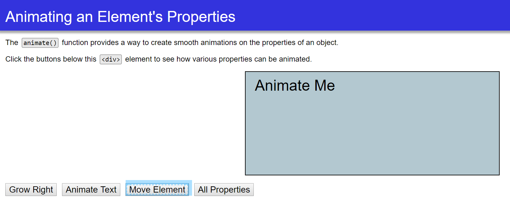
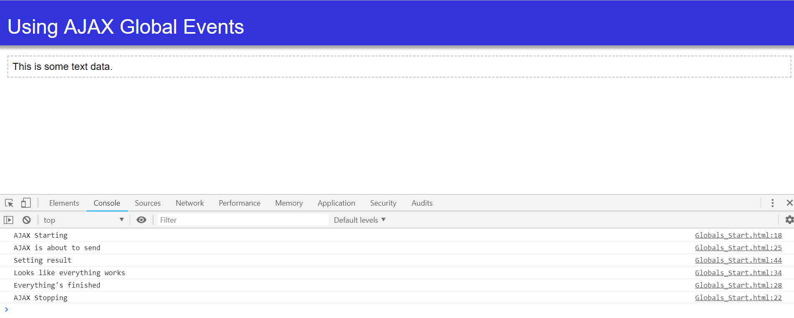

This is a course on JQuery by Joe Marini.
JQuery is an open-source JavaScript library that simplifies the process of adding advanced functionality to web projects.

<ul><b>Topic Covered:</b></ul>
  <li>JQuery's selectors</li>
  <li>Creating and Manipulating Page COntents</li>
  <li>JQuery's Events</li>
  <li>JQuery's Animations to show and hide data</li>
  <li>AJAX to load data</li>

Animation:

AJAX Event Handlers:

2/5/2019
